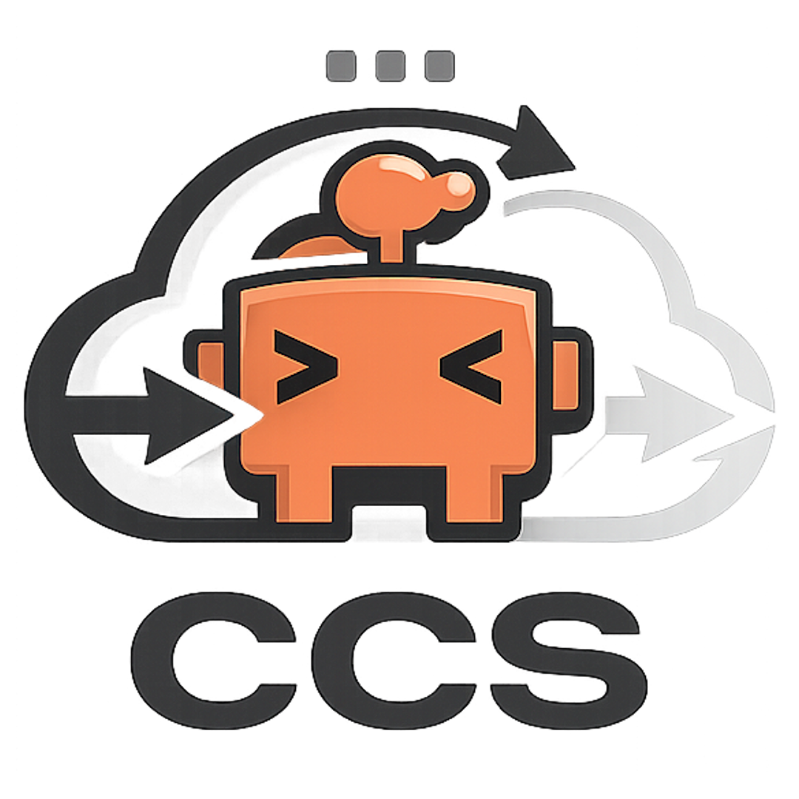

<div align="center">



# `ccs` — Claude Code Switcher

**Switch LLM providers in Claude Code with one command.**  
No config files touched. No mess. No restarts.

[](https://www.gnu.org/software/bash/)
[](https://stedolan.github.io/jq/)
[](https://curl.se/)
[](LICENSE)

</div>

---

## Install

### Linux / macOS

```bash
curl -fsSL https://raw.githubusercontent.com/antonio-abrantes/claude-code-switcher/main/install.sh | bash
```

### Windows (PowerShell 5 & 7)

Para instalar a versão com suporte a **OmniRoute** e melhorias no Windows:

```powershell
.\install-local.ps1
```

*(O instalador local já configura o seu PowerShell Profile, destrava a ExecutionPolicy via Registro e injeta a interceptação corretamente tanto no PS5 quanto no PS7)*

---

Open a new terminal, then:

```bash
ccs
```

Done. Your providers are listed. The installer handles profiles, the active symlink, and shell aliases — zero manual setup.

---

## Commands

| Command | What it does |
| :--- | :--- |
| `ccs` | List all profiles |
| `ccs <name>` | Switch to provider by name (shorthand for `switch`) |
| `ccs switch <name>` | Set the active provider |
| `ccs current` | Show active profile (API key hidden) |
| `ccs add <name>` | Add a new provider interactively |
| `ccs key <name>` | Update an API key in seconds |
| `ccs edit <name>` | Open a profile in `$EDITOR` |
| `ccs remove <name>` | Delete a profile |
| `ccs disable / off` | **(NEW)** Disable CCS and use your system's default global environment variables |
| `ccs test` | Ping the active provider — real API call |
| `ccs run <name> [args]` | Run claude with a named profile |
| `ccs run --provider <p> --url <u> --model <m>` | Run without a saved profile (ephemeral), supports custom `--url` |
| `ccs clean [name]` | Launch Claude Code with no custom agents/skills |
| `ccs uninstall` | Remove CCS, shell aliases, and (optionally) saved profiles |
| `ccs --help` | Show help |

---

## Shell Aliases

The installer writes these to your `.bashrc` / `.zshrc`:

```bash
alias claude='claude --settings $HOME/.config/claude-profiles/active'
alias deepseek='ccs run deepseek'
```

After `ccs switch deepseek`, `claude` talks to DeepSeek. No flags, no env vars.
On Windows, `claude` is automatically intercepted in PowerShell via `$PROFILE` wrapper functions.

---

## 🌐 Custom Base URLs (OmniRoute, etc.)

CCS fully supports Custom APIs like OmniRoute or proxy servers. You can define dynamic base URLs:

```json
{
  "env": {
    "ANTHROPIC_BASE_URL": "https://omniroute.services.softcomia.com/v1",
    "ANTHROPIC_AUTH_TOKEN": "your-key",
    "ANTHROPIC_MODEL": "cx/gpt-5.5"
  }
}
```

You can also test custom URLs ephemerally:
`ccs run --provider omniroute --url https://omniroute.api... --model cx/gpt-5.5 --key 123`

---

## 🧠 Reasoning Effort (`CLAUDE_CODE_EFFORT_LEVEL`)

You can control how much "thinking" the model does before responding by editing your profile's `CLAUDE_CODE_EFFORT_LEVEL`:

- `"default"`: Let the model decide. **Highly recommended** for "mini" models (like `gpt-5-mini` or `haiku`), as they usually do not support configurable effort and will throw an API `400 Error` if you force a high effort.
- `"low"`, `"medium"`, `"high"`, `"max"`: Configures reasoning tokens. Use `"high"` or `"max"` for complex refactoring tasks on large models (like `claude-opus-4.7`).

---

## 💰 Cost Optimization & Model Locking

By default, Claude Code has the freedom to switch between Opus, Sonnet, and Haiku models based on the task, which can quickly consume expensive tokens.

You can use CCS to **lock** Claude Code to specific models (e.g., forcing it to only use Sonnet 3.7 and Haiku 3.5) even if you are using the official Anthropic API.

👉 **[Read the Full Guide on Cost Optimization and Model Locking](docs/model-optimization-guide.md)**

---

## 📚 Documentation Index

If you want to dive deeper into all the features of CCS, check out the detailed guides in the `docs/` folder:

- 📖 **[Complete Usage Guide](docs/usage-guide.md)** — Learn about every CCS command, ephemeral mode, and clean mode.
- 🛠️ **[Step-by-Step Installation Guide](docs/installation-guide.md)** — Detailed instructions for Windows, macOS, Linux, and VPS environments.
- 🚀 **[OmniRoute Integration Guide](docs/omniroute-guide.md)** — How to set up and use custom proxy providers like OmniRoute.
- 📉 **[Cost Optimization Guide](docs/model-optimization-guide.md)** — How to lock models and save API tokens effectively.
- 🔀 **[About CCS (Under the Hood)](docs/about.md)** — Understand how CCS works and why it was built.
- 🗑️ **[Uninstall Guide](docs/uninstall.md)** — How to fully remove CCS (with or without keeping your saved profiles).

---

## Clean Mode

Need a session without your custom agents, skills, and memory files eating context tokens?

```bash
ccs clean           # clean session with active provider
ccs clean deepseek  # clean session with DeepSeek
```

Everything is restored when you exit. Nothing is deleted.

---

## How It Works

Profiles are JSON files in `~/.config/claude-profiles/profiles/`.  
A symlink at `~/.config/claude-profiles/active` points to whichever profile is current.

Claude is always invoked as:

```
claude --settings ~/.config/claude-profiles/active
```

`~/.claude/` is **never touched.** `ccs` lives entirely in `~/.config/claude-profiles/`.

```
~/.config/claude-profiles/
├── profiles/
│   ├── anthropic.json
│   └── deepseek.json
└── active -> profiles/anthropic.json   ← just a symlink
```

Switching providers = updating the symlink. That's the whole trick.

---

## Requirements

- **[Claude Code](https://code.claude.com/docs)** — in `PATH`
- **[jq](https://jqlang.org/)** — for `current`, `key`, and `test`
- **[curl](https://curl.se/)** — for `test` and the installer
- **PowerShell 5.1+** — Windows only

---

## 📄 License

MIT License - see [LICENSE](LICENSE) file for details.

---

<div align="center">

Issues and PRs welcome — [open one here](https://github.com/antonio-abrantes/claude-code-switcher/issues)

</div>