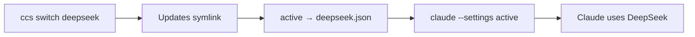
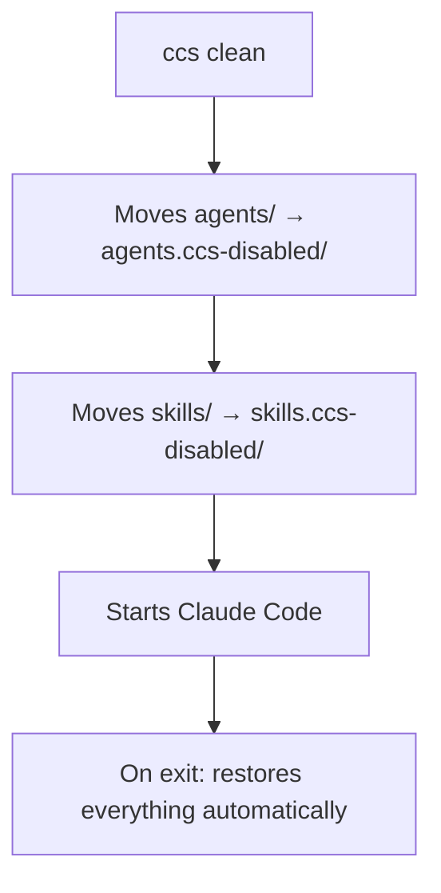

# 🔀 Claude Code Switcher (CCS) — What it is and what it's for

## Quick Summary

**Claude Code Switcher (`ccs`)** is a command-line tool that allows you to **switch the Claude Code AI provider with a single command**. Instead of relying solely on Anthropic (the creators of Claude), you can redirect Claude Code to use **DeepSeek**, **OpenRouter**, **Fireworks AI**, or any other provider compatible with the Anthropic API.

> [!TIP]
> **Simple analogy:** Imagine Claude Code is a car. `ccs` lets you swap the "engine" (the AI provider) without needing to change the whole car. You keep using the same Claude Code interface, but behind the scenes, it could be querying DeepSeek, OpenRouter, etc.

---

## What is it for?

### The Problem it Solves

**Claude Code** is an AI coding tool that, by default, connects only to Anthropic's API. However:

- Anthropic's API can be **expensive** for heavy use
- You might want to test **different models** (DeepSeek is much cheaper, for example)
- You might want to use **alternative providers** offering various models via OpenRouter
- You may need to switch between providers **quickly** during your workday

### What CCS does

| Without CCS | With CCS |
|---------|---------|
| You must configure environment variables manually | Switch instantly with `ccs deepseek` |
| Requires restarting the terminal for each change | No restart needed |
| Configuration spread across multiple files | Everything centralized in JSON profiles |
| Easy to make mistakes in configuration | Guided and safe process |
| No easy way to test if the connection works | `ccs test` checks everything |

---

## Core Concepts

### 1. Profiles

A **profile** is a JSON file containing the configuration for an AI provider. Each profile defines:

- **API Base URL** (`ANTHROPIC_BASE_URL`)
- **Auth Token/API Key** (`ANTHROPIC_AUTH_TOKEN`)
- **Main model** (`ANTHROPIC_MODEL`)
- **Fast/cheap models** for minor tasks (`ANTHROPIC_DEFAULT_HAIKU_MODEL`, `CLAUDE_CODE_SUBAGENT_MODEL`)

**DeepSeek profile example** (`deepseek.json`):
```json
{
  "env": {
    "ANTHROPIC_BASE_URL": "https://api.deepseek.com/anthropic",
    "ANTHROPIC_AUTH_TOKEN": "sk-your-key-here",
    "ANTHROPIC_MODEL": "deepseek-v4-pro[1m]",
    "ANTHROPIC_DEFAULT_OPUS_MODEL": "deepseek-v4-pro[1m]",
    "ANTHROPIC_DEFAULT_SONNET_MODEL": "deepseek-v4-pro[1m]",
    "ANTHROPIC_DEFAULT_HAIKU_MODEL": "deepseek-v4-flash",
    "CLAUDE_CODE_SUBAGENT_MODEL": "deepseek-v4-flash",
    "CLAUDE_CODE_EFFORT_LEVEL": "max"
  }
}
```

**Default Anthropic profile example** (`anthropic.json`):
```json
{
  "env": {}
}
```

> [!NOTE]
> The Anthropic profile is empty (`{}`) because Claude Code uses Anthropic by default. No need to overwrite anything.

### 2. Active Profile

`ccs` maintains a **symbolic link** (symlink) called `active` that points to the currently used profile. When you switch providers, it simply changes where this shortcut points.

### 3. File Structure

```
~/.config/claude-profiles/
├── profiles/
│   ├── anthropic.json      ← Anthropic Profile (default)
│   ├── deepseek.json       ← DeepSeek Profile
│   ├── omniroute.json      ← OmniRoute Profile
│   └── openrouter.json     ← OpenRouter Profile (if created)
└── active → profiles/anthropic.json   ← Link to active profile
```

---

## How it Works Under the Hood

The trick is simple and elegant:



1. You run `ccs switch deepseek`
2. `ccs` updates the `active` symlink to point to `deepseek.json`
3. The `claude` alias always runs with `--settings ~/.config/claude-profiles/active`
4. Claude Code reads the environment variables from the active profile and connects to the corresponding provider

> [!IMPORTANT]
> `ccs` **never** modifies Claude Code's internal files (`~/.claude/`). It lives 100% inside `~/.config/claude-profiles/`.

---

## Supported Providers

| Provider | API URL | Key Variable |
|----------|-----------|-------------------|
| **Anthropic** | (default, no config needed) | `ANTHROPIC_API_KEY` |
| **DeepSeek** | `https://api.deepseek.com/anthropic` | `DEEPSEEK_API_KEY` |
| **OpenRouter** | `https://openrouter.ai/api` | `OPENROUTER_API_KEY` |
| **Fireworks AI** | `https://api.fireworks.ai/inference` | `FIREWORKS_API_KEY` |
| **OmniRoute** | `http://localhost:20128/v1` (or your URL) | `OMNIROUTE_API_KEY` |
| **Any other** | Custom URL | Manual config |

---

## Supported Platforms

| System | Script | Shell |
|---------|--------|-------|
| **Linux** | `ccs` (Bash) | Bash / Zsh |
| **macOS** | `ccs` (Bash) | Bash / Zsh |
| **Windows** | `ccs.ps1` (PowerShell) | PowerShell 5.1+ |

---

## Dependencies

| Tool | What it's for | Required? |
|-----------|---------------|-------------|
| **Claude Code** | The main tool configured by CCS | ✅ Yes |
| **jq** | JSON manipulation (`current`, `key`, `test` commands) | ⚠️ Partial |
| **curl** | Connection testing and installation | ⚠️ Partial |
| **PowerShell 5.1+** | Windows only | ✅ Windows |

---

## Clean Mode (Clean Session)

`ccs` has a special feature: **Clean Mode**. It allows running Claude Code **without custom agents and skills**, saving context tokens.



> [!NOTE]
> If Claude crashes during a clean session, use `ccs clean --restore` to restore manually.

---

## License

MIT — free to use, including commercial use.
